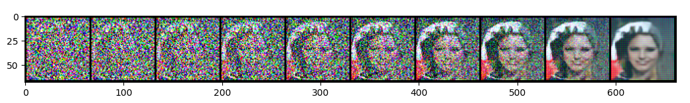
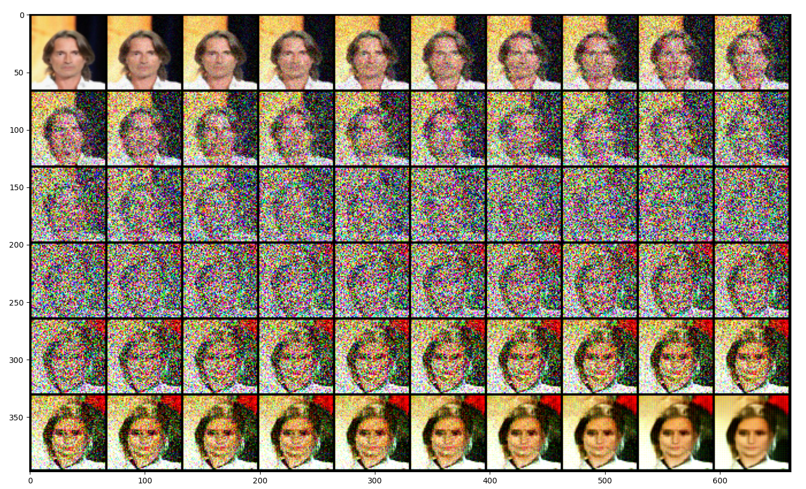

# DDPM

An implementation of [Denoising Diffusion Probablistic Models](https://arxiv.org/pdf/2006.11239.pdf) by Ho et al.

## Results
Progression of a synthesized image using diffusion starting from a sample of Gaussian noise.

Progression of adding noise onto an image then denoising using diffusion model.

## References
- [Diffusion models from scratch in PyTorch](https://www.youtube.com/watch?v=a4Yfz2FxXiY) by DeepFindr.
- Transformer sinusoidal position embedding from [Attention Is All You Need](https://doi.org/10.48550/arXiv.1706.03762) by Vaswani et al.
- [Conditional Image Generation with PixelCNN Decoders](https://doi.org/10.48550/arXiv.1606.05328) by van den Oord et al.
- [PixelCNN++: Improving the Pixel CNN with Discretized Logistic Mixture Likelihood and Other Modifications](https://doi.org/10.48550/arXiv.1701.05517) by Salimans et al.
